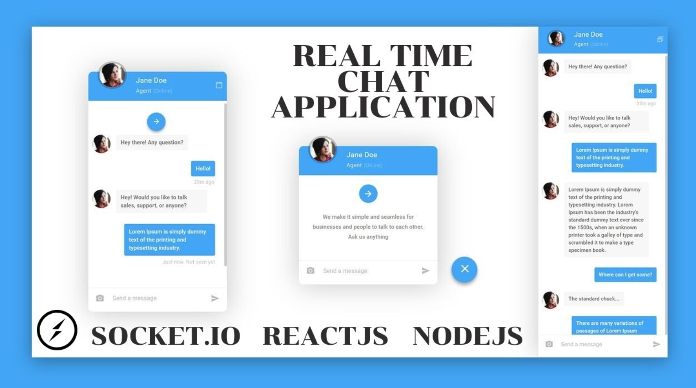

# Realtime Chat Application




## Introduction
This is a code repository for the corresponding video tutorial. 

In this project I create a full Realtime Chat Application.used  React on the front end, with NodeJS + Socket.io web socket library on the back end. 

This Full-Stack realtime chat App will give you a strong understanding of how to send and receive messages using web sockets and Socket.io to make any real-time application.

Setup:
- run ```npm i && npm start``` for both client and server side to start the development server